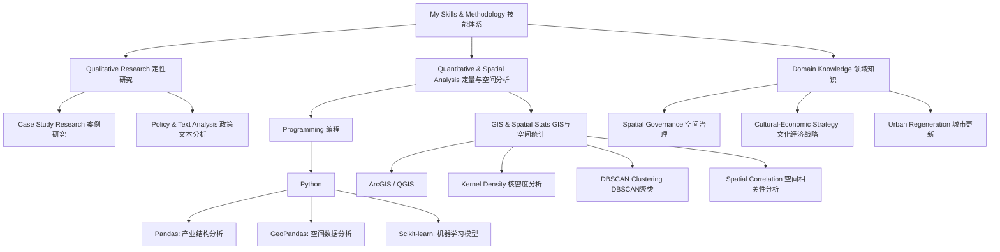

# Academic-personal-homepage-and-portfolio-for-Zheyu-Liu
PhD Applicant in Spatial Governance. Research on culturally-led urban regeneration using mixed methods (GIS, Python, Case Study). 
文化赋能城市更新

# Zheyu (Julie) Liu

**Practitioner-Researcher in Spatial Governance | PhD Applicant**

---

## Research Profile

A spatial planner with a Master's degree from Oxford Brookes University and **four years of professional experience** in strategic consulting across China. My practical work in cultural-economic strategy and industrial planning has directly **informed and solidified** my research interests, driving me to pursue a PhD to investigate the underlying mechanisms of the urban phenomena I engaged with.

我是一名空间规划师，拥有牛津布鲁克斯大学硕士学位及四年中国战略咨询行业经验。在文化经济策略与产业规划领域的实践工作，直接**启发并坚定了**我的研究兴趣，推动我申请博士项目，以深入探究我所接触的城市现象背后的内在机制。

My research proposes a mixed-methods framework to study **culturally-led urban regeneration** and **spatial governance**, bridging data-driven analysis and qualitative insights.
我的研究旨在采用混合方法论，构建一个连接数据驱动分析与定性洞察的框架，以探究**文化引领的城市更新**与**空间治理**。

---

## Selected Projects

### Community Land Trusts & Neighbourhood Planning (UK)
*   **Description**: An MSc thesis investigating how community-led organizations reshape formal housing policies, based on a collective case study in Cornwall.
*   **Methology**: Policy Analysis, Semi-structured Interviews, Comparative Case Study / 政策分析、半结构化访谈、案例比较研究

### Spatial Analysis of Convenience Stores (Beijing) | 便利店空间分析
*   **Description**: A data analytics project modelling the correlation between convenience store distribution (POI) and socio-economic profiles within Beijing's 2nd Ring Road.
*   **Methology**: Kernel Density, DBSCAN Clustering, Spearman’s Correlation, Multiple Linear Regression / 核密度分析、DBSCAN聚类、斯皮尔曼相关、多元线性回归
*   **Tech**: Python (Pandas, GeoPandas, Scikit-learn)

### Cultural-Economic Strategy (China) | 文化经济战略
*   **Description**: Professional experience in cultural gene mining (文化基因挖掘) and strategy development for projects in Suzhou and Anji, transforming historical narratives into place-branding and industrial strategies.

---

### Skills / 技能
### Skills & Methodology / 技能与方法论

I am open to connecting with researchers, practitioners, and potential collaborators. Feel free to reach out for discussion or opportunities.
欢迎与各位研究者、从业者和潜在合作者交流联系。如有任何讨论或机会，请随时与我联系。
