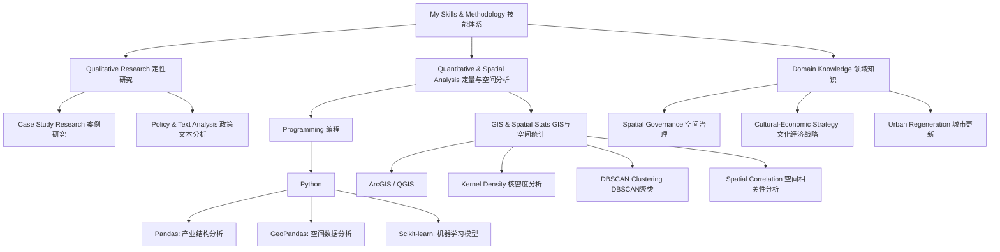

# Academic-personal-homepage-and-portfolio-for-Zheyu-Liu
Urban Governance & Community Development | Mixed-Methods Research (GIS, Python, Case Study）

# Zheyu (Julie) Liu

**Practitioner-Researcher in Spatial Governance | PhD Applicant**

---

## Research Profile

A spatial planner and PhD applicant specializing in grassroots governance and policy implementation within China’s urban transformation. With a Master’s from Oxford Brookes University and four years of strategic consulting experience in China, I leverage mixed-methods research—integrating spatial analysis (GIS), computational tools (Python), and in-depth case studies—to investigate how culture, community, and institutions interact in shaping urban spaces.
My research proposal develops a mixed-methods framework to examine policy mechanisms and community dynamics in culturally-led urban regeneration, seeking to bridge data-driven analysis and qualitative insights for more effective and inclusive governance.
我是一名空间规划师及博士申请人，专注于研究中国城市转型中的基层治理与政策执行。我拥有牛津布鲁克斯大学的硕士学位及四年中国战略咨询经验，擅长运用混合研究方法——结合空间分析（GIS）、计算工具（Python）与深度案例研究——来探究文化、社区与制度如何相互作用并塑造城市空间。
我的研究计划旨在构建一个混合方法框架，以考察文化引领的城市更新中的政策机制与社区动态，力求融合数据驱动分析与定性洞察，为推动更高效、更包容的治理模式提供学术支持。

---

## Selected Projects

### Community Land Trusts & Neighbourhood Planning (UK)
*   **Description**: An MSc thesis investigating how community-led organizations reshape formal housing policies, based on a collective case study in Cornwall.
*   **Methology**: Policy Analysis, Semi-structured Interviews, Comparative Case Study / 政策分析、半结构化访谈、案例比较研究

### Spatial Analysis of Convenience Stores (Beijing) | 便利店空间分析(zheyu-Julie-Liu/qgis-data-analysis-writing-sample/paper.md)
*   **Description**: A data analytics project modelling the correlation between convenience store distribution (POI) and socio-economic profiles within Beijing's 2nd Ring Road.
*   **Methology**: Kernel Density, DBSCAN Clustering, Spearman’s Correlation, Multiple Linear Regression / 核密度分析、DBSCAN聚类、斯皮尔曼相关、多元线性回归
*   **Tech**: Python (Pandas, GeoPandas, Scikit-learn)

### Cultural-Economic Strategy (China) | 文化经济战略
*   **Description**: Professional experience in cultural gene mining (文化基因挖掘) and strategy development for projects in Suzhou and Anji, transforming historical narratives into place-branding and industrial strategies. 
---

## Project in Work

###  [《制度性摩擦与中国基层治理》研究计划](./projects/institutional-friction.md)
*   **Description**:This theory-building project investigates the paradox between China's state-rescaling reforms and policy stagnation at the township level. I propose the concept of "institutional friction" to bridge Neil Brenner's macro-scale theory with micro-level burnout research, offering an integrated explanatory framework for grassroots governance dilemmas.
*    **Status**: Preparing for journal submission & PhD application.
---

## Skills / 技能
### Skills & Methodology / 技能与方法论

I am open to connecting with researchers, practitioners, and potential collaborators. Feel free to reach out for discussion or opportunities.
欢迎与各位研究者、从业者和潜在合作者交流联系。如有任何讨论或机会，请随时与我联系。
