# Academic-personal-homepage-and-portfolio-for-Zheyu-Liu
Urban Governance & Community Development | Mixed-Methods Research (GIS, Python, Case Study）

# Zheyu (Julie) Liu

**Practitioner-Researcher in Spatial Governance | PhD Applicant**

---

## Research Profile

A spatial planner and PhD applicant specializing in grassroots governance and policy implementation within China’s urban transformation. With a Master’s from Oxford Brookes University and four years of strategic consulting experience in China, I leverage mixed-methods research—integrating spatial analysis (GIS), computational tools (Python), and in-depth case studies—to investigate how culture, community, and institutions interact in shaping urban spaces.
My research proposal develops a mixed-methods framework to examine policy mechanisms and community dynamics in culturally-led urban regeneration, seeking to bridge data-driven analysis and qualitative insights for more effective and inclusive governance.
我是一名空间规划师及博士申请人，专注于研究中国城市转型中的基层治理与政策执行。我拥有牛津布鲁克斯大学的硕士学位及四年中国战略咨询经验，擅长运用混合研究方法——结合空间分析（GIS）、计算工具（Python）与深度案例研究——来探究文化、社区与制度如何相互作用并塑造城市空间。
我的研究计划旨在构建一个混合方法框架，以考察文化引领的城市更新中的政策机制与社区动态，力求融合数据驱动分析与定性洞察，为推动更高效、更包容的治理模式提供学术支持。

## 📄 Download My CV

*Click the button above to download the complete thesis in PDF format*

---

## Selected Projects
### Academic Research
**[Master's Thesis Community Land Trusts & Neighbourhood Planning (UK)](zheyu-Julie-Liu/projects/master-thesis.md)**
*   *Description*: An MSc thesis investigating how community-led organizations reshape formal housing policies, based on a collective case study in Cornwall.
*   *Methology*: Policy Analysis, Semi-structured Interviews, Comparative Case Study / 政策分析、半结构化访谈、案例比较研究

**[Spatial Analysis of Convenience Stores (Beijing)| 便利店空间分析](zheyu-Julie-Liu/qgis-data-analysis-writing-sample/blob/main/paper.md)**
*   *Description*: A data analytics project modelling the correlation between convenience store distribution (POI) and socio-economic profiles within Beijing's 2nd Ring Road.
*   *Methology*: Kernel Density, DBSCAN Clustering, Spearman’s Correlation, Multiple Linear Regression / 核密度分析、DBSCAN聚类、斯皮尔曼相关、多元线性回归
*   *Tech*: Python (Pandas, GeoPandas, Scikit-learn)

### Professional Collaborations 
**Cultural-Economic Strategy Collaboration | 文化经济战略合作**
*   *Description*: Collaborated with Professor Hua Yixiong(华亦雄教授) from Jiangnan University on cultural gene mining (文化基因挖掘), identifying and interpreting cultural assets—including folklore, historical anecdotes, and literary references associated with local heritage sites—to build foundational IP for tourism and place branding.
*   *Methodology*: Cultural asset mapping, historical & literary archival research, narrative extraction, IP structuring, brand positioning
*   *Focus*: Transforming intangible cultural heritage into actionable content strategies for regional development (Note: Specific regional applications remain confidential)
*   *Outcome*: Established a transferable methodology for cultural IP development and narrative-driven placemaking
---

## Project in Work

###  [《制度性摩擦与中国基层治理》研究计划](./projects/institutional-friction.md)
*   **Description**:This theory-building project investigates the paradox between China's state-rescaling reforms and policy stagnation at the township level. I propose the concept of "institutional friction" to bridge Neil Brenner's macro-scale theory with micro-level burnout research, offering an integrated explanatory framework for grassroots governance dilemmas.
*    **Status**: Preparing for journal submission & PhD application.
---

## Skills / 技能
### Skills & Methodology / 技能与方法论

```mermaid
graph TD
    A[My Skills & Methodology 技能体系] --> B[Qualitative Research 定性研究];
    A --> C[Quantitative & Spatial Analysis 定量与空间分析];
    A --> D[Domain Knowledge 领域知识];
    
    B --> B1[Case Study Research 案例研究];
    B --> B2[Policy & Text Analysis 政策文本分析];
    
    C --> C1[Programming 编程];
    C --> C2[GIS & Spatial Stats GIS与空间统计];
    
    C1 --> C1a[Python];
    C1a --> C1a1[Pandas: 产业结构分析];
    C1a --> C1a2[GeoPandas: 空间数据分析];
    C1a --> C1a3[Scikit-learn: 机器学习模型];
    
    C2 --> C2a[ArcGIS / QGIS];
    C2 --> C2b[Kernel Density 核密度分析];
    C2 --> C2c[DBSCAN Clustering DBSCAN聚类];
    C2 --> C2d[Spatial Correlation 空间相关性分析];
    
    D --> D1[Spatial Governance 空间治理];
    D --> D2[Cultural-Economic Strategy 文化经济战略];
    D --> D3[Urban Regeneration 城市更新];
```		

I am open to connecting with researchers, practitioners, and potential collaborators. Feel free to reach out for discussion or opportunities.
欢迎与各位研究者、从业者和潜在合作者交流联系。如有任何讨论或机会，请随时与我联系。
